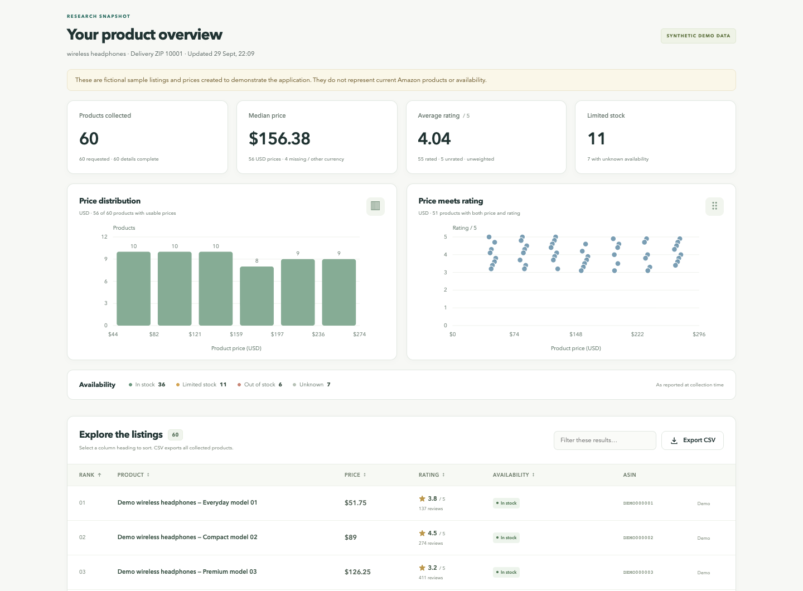
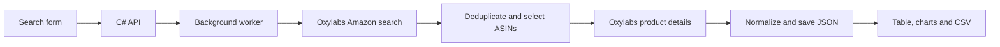

# Amazon Product Explorer

A local product research dashboard built with **C#, ASP.NET Core and Oxylabs Web Scraper API**. Enter a keyword, collect up to 60 unique organic Amazon.com listings, and compare prices, ratings and reported availability.

**Start with Demo mode.** Demo listings are synthetic, clearly labelled and require no credentials. Live mode has a real Oxylabs Push-Pull implementation, but requires your own Web Scraper API account. Automated checks use fixtures and demo data; they do not verify a paid live scrape.



## Start here

1. Install the [.NET 10 SDK](https://dotnet.microsoft.com/en-us/download/dotnet/10.0).
2. Clone this repository and run the app:

```sh
git clone https://github.com/ThibakarSri/amazon-product-explorer.git
cd amazon-product-explorer
dotnet run --project src/AmazonProductExplorer
```

3. Open **http://localhost:5080**, keep **Demo data** selected, and search for 10 products.
4. Follow the [complete beginner setup guide](docs/SETUP.md) to connect Oxylabs and try a small live search.

On macOS/Linux, `./scripts/run.sh` also works. In the original development workspace, it uses the project-local SDK if a system SDK is absent. That SDK is excluded from Git; a fresh clone needs .NET installed.

No npm, frontend bundler, separate database or AI account is required. Python is only used by the optional HTTP smoke-test script.

## What you can do

- Search by keyword with a US delivery ZIP and target of 10, 30 or 60 products.
- View title, price/currency, rating out of five, review count, availability text, ASIN and product link.
- See median price, average listing rating, price distribution, price-versus-rating and stock counts.
- Sort and filter the table, export CSV, cancel work and reopen the last saved job.
- See partial results, unavailable fields and reported limited-stock quantities without inventing missing facts.

“Top” means the first unique, non-sponsored results in Amazon's featured search order for the chosen keyword/location. It does not mean highest sales or highest quality. A search can return fewer products than requested. Demo ASINs are fictional and have no Amazon links.

## Connect Oxylabs

Create a Web Scraper API user in the [Oxylabs dashboard](https://dashboard.oxylabs.io/), then store its credentials in development user secrets:

```sh
dotnet user-secrets set 'Oxylabs:Username' 'YOUR_API_USERNAME' --project src/AmazonProductExplorer
dotnet user-secrets set 'Oxylabs:Password' 'YOUR_API_PASSWORD' --project src/AmazonProductExplorer
```

Replace the placeholders locally. Do not send credentials in chat or commit them. Shell commands containing credentials may be stored in terminal history; see the setup guide for an interactive configuration helper. When using the local SDK, substitute `./scripts/dotnet.sh` for `dotnet`.

Restart the app, select **Live Amazon**, and begin with 10 products. Check sample records and provider usage before increasing to 60. Credential presence enables Live mode; it does not confirm account validity or balance. Each search can involve several search-page jobs plus a detail job for each selected ASIN.

## How it works



The backend makes asynchronous HTTPS calls and uses Oxylabs Push-Pull polling. Job state is saved locally under `App_Data/jobs`. Incomplete work is marked interrupted after restart and is not automatically resubmitted. The browser calculates dashboard summaries from normalized records. See [architecture and API documentation](docs/ARCHITECTURE.md).

## Verify changes

```sh
dotnet build src/AmazonProductExplorer --configuration Release
dotnet run --project tests/AmazonProductExplorer.Checks --configuration Release
python3 scripts/smoke_test.py
```

The executable checks cover parsing, missing values, stock messages, offer selection, variant mismatches and CSV formatting. HTTP smoke checks cover validation, demo collection, export, cancellation and persisted results. GitHub Actions runs these checks without Oxylabs credentials. On Windows, use `python` if `python3` is unavailable.

## Scope and next steps

This is a **local portfolio prototype**, not a public hosted service. The app accepts local connections only. A public GitHub repository shares the code, not a running backend; GitHub Pages cannot run this C# server. Multiple users would need authentication, quotas, durable shared storage and deployment work.

CrewAI is **not implemented**. After the live data flow is validated, a separate Python service could explain the verified results. Numerical calculations and scraped facts should stay deterministic. Historical price charts would require collecting comparable snapshots over time.

Independent project; not affiliated with Amazon or Oxylabs.
