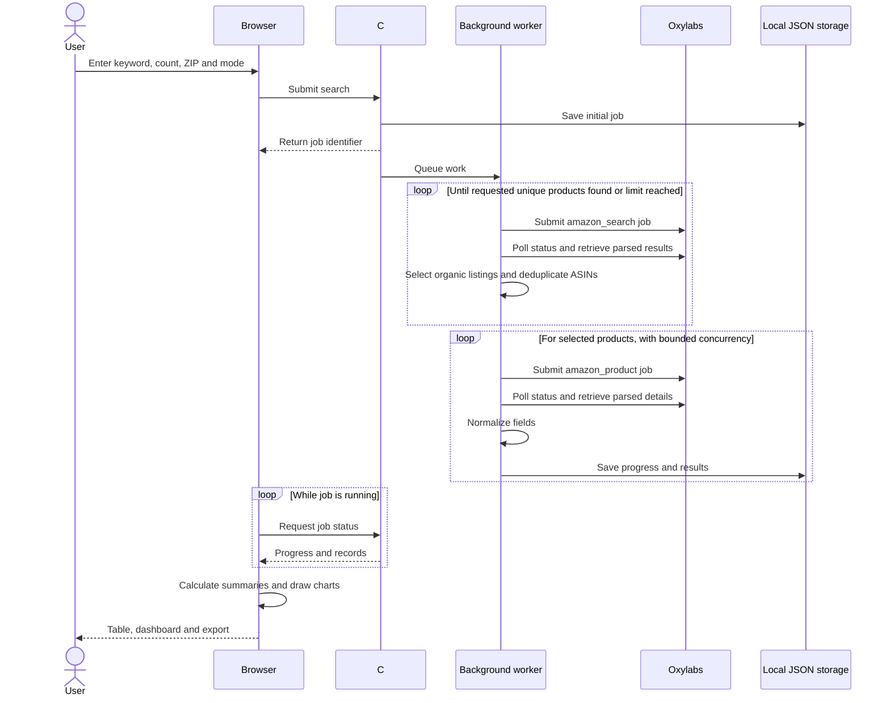

# How Amazon Product Explorer works

Amazon Product Explorer is a local ASP.NET Core application targeting .NET 10. It serves a browser interface and a C# API from the same process. The frontend uses plain HTML, CSS and JavaScript, so there is no frontend build step.

## Request flow



Demo mode uses synthetic records inside the same application. It does not send requests to Oxylabs or Amazon.

## Two meanings of asynchronous

C# `async` and `await` allow network waits without holding a thread idle. That is a programming mechanism.

Oxylabs **Push-Pull** is a remote job workflow: submit a scrape, receive an identifier, check status later, and retrieve the result. This application uses polling, so it can run on localhost without a publicly reachable callback URL. The browser also polls the local API for the overall search progress. These are two separate polling loops. See [Oxylabs Push-Pull](https://developers.oxylabs.io/products/web-scraper-api/integration-methods/push-pull).

## Product selection

The target is between 1 and 60 products. Search requests use `amazon_search` with parsed output, the `com` domain and the chosen US delivery ZIP code. The worker reads organic results, removes repeated ASINs, preserves discovery order, and follows search pages until it has enough unique products or reaches a stopping limit. Sponsored listings do not count toward the target. [Amazon search source](https://developers.oxylabs.io/api-targets/e-commerce/amazon/search)

The resulting sample is the first eligible search results at that time and location. It is not a complete market dataset or a best-seller ranking. Sorting the table by price or rating does not request a new Amazon ranking.

The worker then submits `amazon_product` requests for selected ASINs. Product pages provide additional offer and availability details that a search result can lack. Separate variants remain separate if they have different ASINs. [Amazon product source](https://developers.oxylabs.io/api-targets/e-commerce/amazon/product)

## Normalization rules

| Value | Representation and interpretation |
| --- | --- |
| Title | Text from the returned product details, with the search record available as a fallback when details cannot be obtained. |
| ASIN | The selected product identifier used for deduplication and the canonical Amazon product link. |
| Price | Nullable decimal plus currency. Missing values do not become zero. The visible offer can differ by location or collection time. |
| Rating | Nullable number on the 0–5 scale. Invalid or absent ratings remain missing. |
| Review count | Supporting context for the rating, when available. |
| Availability | A normalized category plus the source message. Missing or unrecognized text remains Unknown. |
| Limited stock | A reported quantity only when explicitly present in a recognized message. It is not total inventory. |
| Search position | Discovery order before the user sorts the table. |
| Timestamp | Time the record was collected, so results are understood as a snapshot. |

The offer mapper excludes entries labelled used, renewed, refurbished, subscription or rental, then prefers a one-time/new entry among those remaining. It takes both price and stock from that selected entry. If a buy-box array exists but contains no eligible offer, price remains missing and availability remains unknown. If no buy-box array is present, it can use the product's top-level fields. Offer labels and provider responses may be incomplete; this is a consistent display policy rather than a guarantee that all offers were compared.

Parsing belongs in deterministic C# code. It must not use an AI model to fill missing facts. If Oxylabs changes its response schema, update the parser and its representative fixtures together.

## Metrics and presentation

The backend returns normalized records. The frontend calculates numerical summaries and draws the charts from those records using ordinary JavaScript. Missing prices or ratings are excluded from the corresponding numeric calculations; zero is not substituted. Currency must be respected when interpreting prices. For a later AI service or multiple clients, shared backend metric calculations would help keep every consumer consistent.

Charts describe only the collected sample. They do not estimate sales, certify quality or establish historical trends. A future historical view needs stored snapshots from separate collection times, with comparable location and query settings.

The UI should remain useful during partial failure: display collected rows, show progress and explain which detail requests could not complete. Search-only fallback rows should not imply that product-detail availability was verified.

## Storage and lifecycle

Job state and results are written as JSON under `App_Data/jobs` in the application content root. The directory is excluded from Git. This gives a beginner a working local persistence mechanism without database installation.

The processing queue runs inside the application process. Persisted records are reloaded after a restart. Any job that had not reached a terminal state is marked `interrupted`; it is not automatically resubmitted. This is not a distributed, resumable job system. Avoid stopping the process during paid work; an already submitted provider job may continue remotely.

The store admits at most three unfinished application jobs, and the worker processes jobs from one local queue. Product-detail requests within a job have their own concurrency limit. Cancellation stops local processing as soon as possible, but cannot promise cancellation or a refund for already submitted provider jobs.

The Oxylabs client retries selected transient failures when reading status or results. It does not automatically retry a submission POST, because a lost response could still mean that a billable job was created.

For a multi-user deployment, replace file storage and the in-memory queue with durable shared storage and a worker queue. Design recovery around the provider's persisted job IDs so retries do not accidentally submit duplicate paid work.

## Credentials and network boundary

The browser calls only the local application API. The backend makes authenticated HTTPS requests to Oxylabs. Credentials belong in development user secrets or a production secret store; frontend assets and Git-tracked configuration must not contain them.

The normal launch address is `http://localhost:5080`. The application has no multi-user authentication or billing isolation and is intended for local use. Binding it to a public network requires authentication, authorization, request quotas, HTTPS and secure configuration first.

The server also checks that requests come from loopback addresses with a local host name, and rejects cross-site mutation requests. Those controls protect the local prototype; they do not replace an authentication design for a hosted service.

## API reference

| Method and path | Purpose |
| --- | --- |
| `GET /api/config` | Return whether server credentials are configured and the maximum product count. It never returns credentials. |
| `POST /api/jobs` | Validate input, save and queue a job, and return HTTP 202 with its `id`. |
| `GET /api/jobs/{id}` | Return job status, progress, warnings and product records. |
| `POST /api/jobs/{id}/cancel` | Request cancellation of local processing. |
| `GET /api/jobs/{id}/export` | Download the current records as CSV. |

Example request body for a demo job:

```json
{
  "query": "wireless headphones",
  "limit": 10,
  "zipCode": "10001",
  "mode": "demo"
}
```

Queries must contain 2–120 characters, the count must be 1–60, and the ZIP code must contain exactly five digits. The only modes are `demo` and `live`. Live mode is rejected before job submission if credentials are missing. At most three unfinished jobs can be admitted; further submissions receive HTTP 429.

Job states are `queued`, `searching`, `enriching`, then a terminal state: `completed`, `partial`, `failed`, `cancelled` or `interrupted`. The accompanying message and warnings explain the result. A completed search can have fewer rows than requested if no further organic matches were returned.

## File tour

| Location | Responsibility |
| --- | --- |
| `src/AmazonProductExplorer/Program.cs` | Application startup, service registration, local-request checks and API endpoints. |
| `src/AmazonProductExplorer/Models.cs` | Request, product, job and configuration types. |
| `src/AmazonProductExplorer/OxylabsClient.cs` | HTTPS authentication, job submission, polling, result retrieval and bounded read retries. |
| `src/AmazonProductExplorer/ProductParser.cs` | Search/detail response mapping, offer selection and availability normalization. |
| `src/AmazonProductExplorer/ScrapeWorker.cs` | Demo data, live pagination, ASIN deduplication and concurrent detail retrieval. |
| `src/AmazonProductExplorer/JobStore.cs` | Local queue, admission limit, cancellation and JSON persistence. |
| `src/AmazonProductExplorer/CsvExporter.cs` | CSV formatting and export handling. |
| `src/AmazonProductExplorer/wwwroot/` | Browser interface, styles, JavaScript and local visual assets. |
| `src/AmazonProductExplorer/appsettings.json` | Non-secret local settings and request limits. |
| `src/AmazonProductExplorer/Properties/launchSettings.json` | Local development address and Development environment. |
| `tests/AmazonProductExplorer.Checks/` | Executable checks for important data-handling behavior. |

Run the checks from the repository root:

```sh
dotnet run --project tests/AmazonProductExplorer.Checks
```

## Future CrewAI integration

CrewAI is deliberately an optional later component. A separate Python service could accept normalized records and precomputed metrics, then return a written comparison. Move shared metric calculations into C# for that integration so the browser and AI service receive the same values. Facts, validation and arithmetic should remain deterministic. The AI output should identify its evidence, acknowledge unknown fields and be labelled as generated analysis.

The current repository does not include a CrewAI service, Python environment or language-model dependency. See the [CrewAI introduction](https://docs.crewai.com/en/introduction) when the data pipeline is stable and there is a concrete analysis task worth adding.

## Practical implementation order

1. Run the synthetic demo and understand how the frontend calls the API.
2. Configure credentials and validate a small search against live provider responses.
3. Check search selection, deduplication, field mapping and missing-value behavior.
4. Compare table records and dashboard calculations; verify partial failures are visible.
5. Check provider usage and expand to a 60-product target.
6. Add authentication and durable infrastructure before hosting for other users.
7. Add historical comparison or optional AI summaries only after the core facts are reliable.
